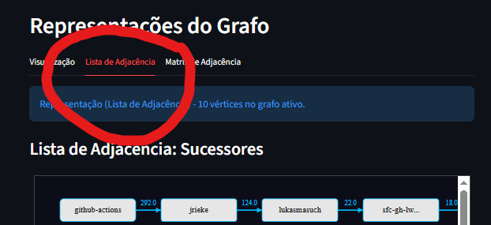

# Documentação Completa do Projeto de Análise de Grafos de Repositórios GitHub

## 📋 Índice

1. [Visão Geral do Projeto](#1-visão-geral-do-projeto)
2. [Arquitetura do Sistema](#2-arquitetura-do-sistema)
3. [Extração de Dados do GitHub](#3-extração-de-dados-do-github)
4. [Armazenamento no Banco de Dados Neo4j](#4-armazenamento-no-banco-de-dados-neo4j)
5. [Estruturas de Dados de Grafos](#5-estruturas-de-dados-de-grafos)
6. [Métricas Implementadas e Complexidade](#6-métricas-implementadas-e-complexidade)
7. [Visualizações e Grafos](#7-visualizações-e-grafos)
    7.1 [Páginas Streamlit](#71-páginas-streamlit)
        7.1.1 [Barra Lateral (Sidebar)](#711-barra-lateral-sidebar)
    
8. [Como Executar o Projeto](#8-como-executar-o-projeto)
9. [Testes e Qualidade de Código](#9-testes-e-qualidade-de-código)
10. [Referências e Conclusão](#10-referências-e-conclusão)

---

## Sumário Executivo

Este documento apresenta uma visão completa do projeto de análise de grafos desenvolvido para o trabalho prático da disciplina de Grafos da PUC Minas. O sistema realiza **coleta, armazenamento, processamento e visualização** de dados de interações em repositórios GitHub, utilizando teoria de grafos para extrair métricas e insights sobre colaboração em projetos de código aberto.

**Repositório Analisado:** [streamlit/streamlit](https://github.com/streamlit/streamlit)

**Principais Contribuições:**
- Implementação completa de estruturas de dados de grafos (Lista e Matriz de Adjacência)
- Métricas de centralidade implementadas do zero (sem bibliotecas externas)
- Detecção de comunidades usando algoritmo de Girvan-Newman
- Interface web interativa com Streamlit
- Integração com banco de dados de grafos Neo4j

---

## 1. 🎯 Visão Geral do Projeto

### 1.1 Objetivo

O projeto implementa um sistema completo de análise de grafos para estudar padrões de colaboração em repositórios GitHub. Através da modelagem de interações (comentários, reviews, merges) como um **grafo direcionado, simples e ponderado**, o sistema permite:

- ✅ **Identificar desenvolvedores influentes** através de métricas de centralidade
- ✅ **Detectar comunidades** de colaboradores que trabalham juntos
- ✅ **Analisar padrões estruturais** de colaboração
- ✅ **Visualizar redes de interação** de forma interativa
- ✅ **Exportar dados** para ferramentas especializadas (Gephi)

### 1.2 Tecnologias Utilizadas

| Tecnologia | Versão | Finalidade |
|------------|--------|------------|
| **Python** | 3.10+ | Linguagem principal do projeto |
| **Neo4j** | 6.0.2 | Banco de dados de grafos |
| **Streamlit** | 1.51.0 | Framework para interface web interativa |
| **BeautifulSoup4** | 4.14.2 | Web scraping de páginas do GitHub |
| **Matplotlib** | 3.10.7 | Visualização de grafos |
| **Pandas** | 2.3.3 | Manipulação de dados tabulares |
| **Plotly** | 6.5.0 | Gráficos interativos |
| **Pytest** | 8.4.2 | Framework de testes automatizados |

### 1.3 Integrantes do Projeto

- Diogo Caribe Brunoro
- Gabriel Nogueira Vieira Resende
- Gabriel Reis Lebron de Oliveira
- Gustavo Azi Prehl Gama
- Guilherme de Almeida Rocha Vieira
- Felipe Augusto Pereira de Sousa

### 1.4 Modelo de Grafo

**Tipo:** Grafo direcionado, simples e ponderado (dígrafo ponderado)

**Vértices (Nós):** Autores que interagiram no repositório

**Arestas (Relações):** Interações entre autores:
- Comentários em issues/PRs
- Reviews de código
- Aprovações de PRs
- Merges de PRs
- Fechamento de issues

**Pesos:** Cada tipo de interação possui um peso que reflete sua importância:
- MERGE = 5 (mais crítico)
- REVIEW/APPROVED = 4
- ISSUE_COMMENTED = 3
- COMMENT = 2
- ISSUE_CLOSED = 1

---

## 2. 🏗️ Arquitetura do Sistema

### 2.1 Diagrama de Componentes

```
┌─────────────────────────────────────────────────────────────┐
│                    Interface Streamlit                      │
│  ┌──────────┐  ┌──────────┐  ┌──────────┐  ┌──────────┐     │ 
│  │ Página 1 │  │ Página 2 │  │ Página 3 │  │ Página 4 │     │
│  │Comentário│  │Fechamento│  │ Reviews  │  │Integrado │     │
│  └──────────┘  └──────────┘  └──────────┘  └──────────┘     │
│                      │ Página 5: Métricas │                 │
└──────────────────────┼────────────────────┼─────────────────┘
                       │                    │
                       ▼                    ▼
┌─────────────────────────────────────────────────────────────┐
│                  Camada de Serviços                         │
│  ┌─────────────┐  ┌──────────────┐  ┌──────────────┐        │
│  │   Graph     │  │    Neo4j     │  │   Shared     │        │
│  │  Service    │  │   Service    │  │   Queries    │        │
│  └─────────────┘  └──────────────┘  └──────────────┘        │
└──────────────────────┼──────────────────────────────────────┘ 
                       │
                       ▼
┌─────────────────────────────────────────────────────────────┐
│                 Camada de Dados                             │
│  ┌──────────────┐              ┌──────────────┐             │
│  │    Neo4j     │◄─────────────┤   GitHub     │             │
│  │   Database   │              │  Collector   │             │
│  └──────────────┘              └──────────────┘             │
└─────────────────────────────────────────────────────────────┘
```

### 2.2 Estrutura de Diretórios

```
graph-analysis-of-gh-repo/
├── config/                    # Configurações do projeto
│   └── settings.py           # Credenciais Neo4j
├── src/
│   ├── analysis/             # Módulos de análise
│   │   ├── centrality_metrics.py    # Degree, Betweenness, Closeness, PageRank, Eigenvector
│   │   ├── community_metrics.py     # Girvan-Newman, Bridging Ties
│   │   └── structure_metrics.py     # Densidade, Clustering, Assortatividade
│   ├── collectors/           # Coleta de dados
│   │   └── github_collector.py      # Web scraping
│   ├── core/                 # Estruturas de grafos
│   │   ├── AbstractGraph.py         # Interface abstrata
│   │   ├── AdjacencyListGraph.py    # Lista de adjacência
│   │   └── AdjacencyMatrixGraph.py  # Matriz de adjacência
│   ├── pages/                # Páginas Streamlit (5 páginas)
│   ├── services/             # Lógica de negócio
│   ├── ui/                   # Componentes UI
│   └── utils/                # Utilitários
├── tests/                    # Testes pytest
├── diagramas/                # Diagramas do projeto
├── db.py                     # Script de inserção Neo4j
├── github_collector.py       # Script standalone de coleta
└── requirements.txt          # Dependências
```

### 2.3 Padrões de Projeto Utilizados

- **Singleton:** `neo4j_connector.py` garante uma única instância de conexão Neo4j
- **Strategy:** Diferentes implementações de grafo (Lista vs Matriz) com mesma interface
- **Template Method:** `AbstractGraph` define algoritmo esqueleto, subclasses implementam passos
- **Repository:** `neo4j_service.py` encapsula acesso a dados

---

## 3. 📊 Extração de Dados do GitHub

A coleta de dados utiliza uma **estratégia híbrida** para maximizar a cobertura e a robustez, empregando **Web Scraping** como método principal para Issues e a **API REST** do GitHub como fallback e como método exclusivo para Pull Requests.

### 3.1 Estratégia de Coleta

| Tipo de Dados | Estratégia Primária | Estratégia Secundária (Fallback) | Motivação |
|:--------------|:--------------------|:--------------------------------|:----------|
| **Issues** | Web Scraping (JSON embutido) | API REST do GitHub | Prioriza a coleta sem autenticação/limite de taxa; API como contingência para falhas de *parsing* HTML. |
| **Pull Requests**| API REST do GitHub | N/A | A estrutura HTML não continha um *payload* JSON estruturado, tornando o *scraping* inviável. |

#### 3.1.1 Técnica de Extração

O GitHub embute dados estruturados em tags `<script>` com JSON:

```python
def html_to_json(response):
    """
    Extrai dados JSON embutidos no HTML.
    O GitHub renderiza React apps com dados em:
    <script type="application/json" data-target="react-app.embeddedData">
    """
    soup = BeautifulSoup(response.text, 'html.parser')
    script_tag = soup.find('script', {
        'type': 'application/json',
        'data-target': 'react-app.embeddedData'
    })
    return json.loads(script_tag.string)
```

#### 3.2 Processo de Coleta

```
3.1.1 Issues (Scraping com Fallback): 

    1. Coleta Inicial (Paginada): Faz requests para a primeira página de issues abertas.

    2. Extração de Metadados:
        * Tenta extrair dados estruturados via JSON embutido (Scraping).

        * Em caso de erro (parsing falhar ou tag JSON ausente), o processo aciona o fallback da API do GitHub para obter os dados.

    3. Loop Paginado (páginas 2 a N): Repete a extração e o fallback para as páginas subsequentes, calculadas a partir do total de issues.

    4. Coleta de Detalhes: Para cada issue coletada, realiza uma nova requisição para extrair o corpo completo e todos os comentários, utilizando a mesma lógica de fallback para garantir a robustez.

3.3.2 Pull Requests (Exclusivamente API):

    1. Coleta de Pull Requests: Utiliza a API REST do GitHub para listar as pull requests.

    2. Coleta de Detalhes: Para cada pull request, são feitas requisições subsequentes via API para obter comentários, arquivos alterados e outros metadados.
```

#### 3.3 Dados Coletados

**Issues:**
```python
{
    'id': 'I_kwDOAhN3Vr...',       # ID único GitHub
    'number': 12345,                # Número da issue
    'title': 'Bug in component X',
    'body': 'Descrição completa...',
    'createdAt': '2024-01-15T10:00:00Z',
    'author': 'username',
    'state': 'OPEN' | 'CLOSED',
    'closed': True | False,
    'comments': [...]               # Lista de comentários
}
```

**Pull Requests:**
```python
{
    'id': 123456,
    'number': 7890,
    'title': 'Fix memory leak',
    'body': 'Descrição...',
    'createdAt': '2024-01-15T...',
    'closedAt': '2024-01-20T...',  # null se ainda aberto
    'mergedAt': '2024-01-20T...',  # null se não merged
    'author': 'dev_name',
    'status': 'MERGED' | 'CLOSED' | 'OPEN',
    'mergedBy': 'maintainer_name',  # quem fez merge
    'approvers': ['user1', 'user2'], # aprovadores
    'comments': [...],               # comentários gerais
    'review_comments': [...],        # comentários em código
    'reviews': [...]                 # eventos de review
}
```

### 3.4 Complexidade da Coleta

| Operação | Complexidade | Observações |
|:----------|:-------------|:------------|
| Coletar 1 página de issues (Scraping) | $O(1)$ | HTTP request + parsing. Otimizado por JSON embutido. |
| Coletar **Total Issues** com detalhes | $O(I)$ | Linear no número total de *issues* ($I$). |
| Coletar **Total PRs** com detalhes (API) | $O(P)$ | Linear no número total de *Pull Requests* ($P$). |
| **Total da Coleta** | $O(I + P)$ | A complexidade geral é a soma das complexidades de coleta de *Issues* e *Pull Requests*. |

**Tempo real:** ~3-5 segundos por issue (throttling manual para evitar bloqueio)

**Otimizações implementadas:**
- Cache de Respostas HTTP: Reduz o número de requisições repetidas.
- Throttling Manual (Scraping): Delay de 1-3s entre requisições para evitar bloqueio (essencial para a robustez do scraping).
- Reuso de Sessão HTTP: Utilização de conexões persistentes para reduzir a sobrecarga de handshake.
- Fallback da API (Issues): Garante a continuidade da coleta e mitiga a dependência de falhas estruturais do HTML.

### 3.5 Limitações e Trade-offs

| Aspecto | Vantagens | Desvantagens |
|:--------|:----------|:-------------|
| **Web Scraping (Issues)** | ✅ Sem autenticação necessária. | ❌ Dependente da estrutura HTML (pode quebrar). |
| | ✅ Sem limite de *rate limiting* da API. | ❌ Mais lento devido ao *throttling* manual (3-5s por *issue*). |
| **API REST (PRs e Fallback)** | ✅ Estrutura de dados estável e oficial. | ❌ Sujeito ao limite de *rate limiting* da API do GitHub (requer autenticação ou tolerância de taxa). |
| | ✅ Processo mais rápido e menos propenso a quebras de tela. | ❌ Requer gerenciamento de autenticação e taxa de requisições. |


## 4. 💾 Armazenamento no Banco de Dados Neo4j

### 4.1 Por que Neo4j?

Neo4j é um banco de dados de grafos nativo que armazena dados como **nós** e **relacionamentos**, ideal para:
- Queries de travessia de grafo (pathfinding)
- Análise de padrões de conexão
- Agregação de métricas de rede
- Visualização de grafos

### 4.2 Modelo de Dados

#### 4.2.1 Nós (Vertices)

**Author**
```cypher
(:Author {
    login: String  // Nome de usuário GitHub (unique)
})
```

**Issue**
```cypher
(:Issue {
    id: String,    // ID GitHub
    number: Integer,  // Número da issue (unique no repo)
    title: String,
    body: String,
    createdAt: DateTime,
    state: String,      // "OPEN" ou "CLOSED"
    closed: Boolean
})
```

**PullRequest**
```cypher
(:PullRequest {
    id: Integer,
    number: Integer,
    title: String,
    body: String,
    createdAt: DateTime,
    closedAt: DateTime,
    mergedAt: DateTime,
    status: String
})
```

**Comment**
```cypher
(:Comment {
    id: String,
    body: String,
    createdAt: DateTime
})
```

**Review**
```cypher
(:Review {
    id: Integer,
    state: String,  // "APPROVED", "CHANGES_REQUESTED", "COMMENTED"
    body: String,
    submittedAt: DateTime
})
```

#### 4.2.2 Relacionamentos (Arestas)

```cypher
// Criação
(Author)-[:CREATED]->(Issue | PullRequest)

// Comentários
(Issue | PullRequest)-[:HAS_COMMENT]->(Comment)
(PullRequest)-[:HAS_REVIEW_COMMENT]->(Comment)
(Author)-[:AUTHORED]->(Comment)

// Reviews
(PullRequest)-[:HAS_REVIEW]->(Review)
(Author)-[:PERFORMED_REVIEW]->(Review)

// Ações em PRs
(Author)-[:APPROVED]->(PullRequest)
(Author)-[:MERGED]->(PullRequest)

// Fechamento
(Author)-[:CLOSED]->(Issue)
```

### 4.3 Inserção de Dados

#### 4.3.1 Transações Atômicas

```python
class Neo4jService:
    def insert_issue_data(self, issue_data):
        """
        Insere issue + comentários atomicamente.
        Se falhar, rollback automático.
        """
        with self.driver.session() as session:
            session.execute_write(
                self._create_issue_and_comments_transaction,
                issue_data
            )
```

#### 4.3.2 MERGE para Idempotência

```cypher
-- Evita duplicatas ao re-executar script
MERGE (a:Author {login: $author_login})
ON CREATE SET a.firstSeen = timestamp()
ON MATCH SET a.lastSeen = timestamp()

MERGE (i:Issue {number: $issue_number})
ON CREATE SET i.id = $id, i.title = $title, ...
ON MATCH SET i.title = $title, ...  -- atualiza se já existe
```

### 4.4 Queries de Agregação

O arquivo `src/services/shared_queries.py` centraliza queries Cypher:

#### Query: Comentários em Issues/PRs

```cypher
MATCH (src:Author)-[:AUTHORED]->(comment:Comment)
MATCH (target:Issue|PullRequest)-[:HAS_COMMENT]->(comment)
MATCH (target)<-[:CREATED]-(dst:Author)
WHERE src <> dst
RETURN id(src) AS srcId, id(dst) AS dstId
```

**Interpretação:** `src` comentou em issue/PR criada por `dst`

#### Query: Reviews de PRs

```cypher
MATCH (src:Author)-[:PERFORMED_REVIEW]->(review:Review)
MATCH (pr:PullRequest)-[:HAS_REVIEW]->(review)
MATCH (dst:Author)-[:CREATED]->(pr)
WHERE src <> dst
RETURN id(src) AS srcId, id(dst) AS dstId
```

#### Query: Merges

```cypher
MATCH (src:Author)-[:MERGED]->(pr:PullRequest)
MATCH (dst:Author)-[:CREATED]->(pr)
WHERE src <> dst
RETURN id(src) AS srcId, id(dst) AS dstId
```

### 4.5 Complexidade das Queries

| Query | Complexidade Neo4j | Otimização |
|-------|-------------------|------------|
| Buscar autores | O(n) | Índice automático em label |
| Comentários | O(a × c) | a autores, c comentários médios |
| Reviews | O(a × r) | Índice em [:PERFORMED_REVIEW] |
| Pathfinding | O(V + E) | BFS nativo do Neo4j |

**Índices criados automaticamente:**
- `Author.login`
- `Issue.number`
- `PullRequest.number`

---

## 5. 🔗 Estruturas de Dados de Grafos

### 5.1 Hierarquia de Classes

```
AbstractGraph (ABC)
├── AdjacencyListGraph
└── AdjacencyMatrixGraph
```

### 5.2 Interface Abstrata

```python
class AbstractGraph(ABC):
    """Interface que TODAS as implementações devem seguir."""
    
    # Obrigatórios (abstract methods)
    @abstractmethod
    def hasEdge(self, u: int, v: int) -> bool
    
    @abstractmethod
    def addEdge(self, u: int, v: int, weight: float) -> bool
    
    @abstractmethod
    def removeEdge(self, u: int, v: int) -> None
    
    @abstractmethod
    def getVertexInDegree(self, v: int) -> int
    
    @abstractmethod
    def getVertexOutDegree(self, v: int) -> int
    
    # Comuns (implementados na classe base)
    def getVertexCount(self) -> int
    def getEdgeCount(self) -> int
    def isSucessor(self, u, v) -> bool
    def isPredecessor(self, u, v) -> bool
    def isDivergent(...) -> bool
    def isConvergent(...) -> bool
    def isConnected() -> bool
    def isCompleteGraph() -> bool
```

### 5.3 Lista de Adjacência

#### 5.3.1 Estrutura Interna

A classe `AdjacencyListGraph` utiliza uma **lista de dicionários** para armazenar o grafo:

```python
class AdjacencyListGraph(AbstractGraph):
    def __init__(self, num_vertices: int):
        super().__init__(num_vertices)
        # Lista de dicionários: adj[u] = {v: peso}
        self._adjacency_list: list[dict[int, float]] = [
            {} for _ in range(num_vertices)
        ]
```

**Exemplo Visual:**
```python
Grafo: 0→1(2.0), 0→2(3.0), 1→2(1.0)

_adjacency_list = [
    {1: 2.0, 2: 3.0},  # vizinhos de 0
    {2: 1.0},          # vizinhos de 1
    {}                 # vizinhos de 2 (nenhum)
]
```

#### 5.3.2 Visão Geral de Fluxo de Execução

##### Passo 1: Usuário Escolhe a Representação



##### Passo 2: Chamada da Função Principal de Display

A função responsável por isso é a `display_adjacency_lists_streamlit`, que possui as responsabilidades de: 

- Exibir **lista de sucessores** (vizinhos de saída)
- Exibir **lista de predecessores** (vizinhos de entrada)

**No código (Em 1_Grafo_Comentarios_(PR_e_Issue)):**
```python
       with tab2:
                st.info(f"Representação (Lista de Adjacência) - {current_vertex_count} vértices no grafo ativo.")
                
                display_adjacency_lists_streamlit(
                    graph=graph, 
                    idx_to_name=idx_to_name, 
                    indices_to_render=indices_to_render_internal 
                )
```

##### Passo 3: Renderização de Sucessores e Predecessores

Dentro do código `display_adjacency_lists_streamlit`, que esta localizado no **serviço** `adjacency_list_service` é chamado duas funções que possuem toda a lógica de processamento interno, que seria a `_render_adjacency_list_svg`, ela é repetida duas veze porque uma é para a de sucessores e a outra para a de predecessores

**No código (Em adjacency_list_service):**

```python
    # Exibir lista de sucessores
    _render_adjacency_list_svg(
        graph=graph,
        idx_to_name=idx_to_name,
        indices_to_render=indices_to_render,
        title="Lista de Adjacência: Sucessores",
        download_filename_prefix="lista_adjacencia_sucessores",
        is_predecessor_view=False
    )
    
    st.markdown("---") 
    
    # Exibir lista de antecessores
    _render_adjacency_list_svg(
        graph=graph,
        idx_to_name=idx_to_name,
        indices_to_render=indices_to_render,
        title="Lista de Adjacência: Predecessores",
        download_filename_prefix="lista_adjacencia_predecessores",
        is_predecessor_view=True
    )
```

###### Passo 4: Processamento Interno (Dentro de _render_adjacency_list_svg)

A função `_render_adjacency_list_svg` é responsável por construir visualmente, em formato SVG, a lista de adjacência de cada vértice selecionado. Sua função é gerar toda a lógica gráfica, incluindo caixas dos nós, conexões, pesos, setas e tooltips, e então exibir esse SVG dentro do **Streamlit** com suporte a download.

Ela executa quatro tarefas principais:

**1. Configuração inicial do ambiente gráfico (SVG)**. Define tamanhos, espaçamentos (estilos globais do desenho) e cria a area de desenho `svgwrite.Drawing` 

**2. Para cada nó selecionado** Calcula sua posição vertical baseada no índice do loop, desenha a caixa retangular do nó principal usando `svgwrite.rect` e insere o nome abreviado centralizado e o nome completo via (tooltip).

**3. Identificação dos vizinhos** 

Para cada nó principal, a função chama `_get_neighbors_from_graph`, que detecta se o grafo é lista ou matriz de adjacência e 
retorna um dicionário `{vizinho: peso}` para aquele nó.

Além disso também é filtrado os vizinhos que não pertencem aos nós selecionados pelo `indices_to_render`.

**4. Renderização gráfica dos vizinhos** 

Para cada vizinho encontrado será desenhado a aresta (linha + seta) e a caixa do vizinho, conectando o nó principal ao vizinho.

```
[Nó principal] → peso → [Vizinho 1] → peso → [Vizinho 2] ...
```

**5. Exibição final no Streamlit** 

Converte o svg para string e gera uma versão ajustada do SVG para download. Além de renderizar o botão para baixar o arquivo .svg.


#### 5.3.3 Operações

Nesta subseção listamos as funcionalidades expostas pela interface/`AbstractGraph` (assinaturas e propósito), sem reproduzir suas implementações. Cada implementação concreta (`AdjacencyListGraph` e `AdjacencyMatrixGraph`) fornece essas operações de acordo com a sua estrutura interna.

- `addEdge(u: int, v: int, weight: float = 1.0)` — Adiciona ou atualiza uma aresta de `u` para `v` com o peso informado. Retorna um booleano indicando se uma aresta nova foi criada ou apenas atualizada. Complexidade: Lista O(1) amortizado (inserção em dicionário); Matriz O(1) (atribuição).

- `removeEdge(u: int, v: int)` — Remove a aresta (se existir). Complexidade: Lista O(1) amortizado (remoção em dicionário); Matriz O(1) (escrita em array).

- `hasEdge(u: int, v: int) -> bool` — Verifica se existe aresta de `u` para `v`. Complexidade: Lista O(1) médio (lookup em dicionário); Matriz O(1).

- `getEdgeWeight(u: int, v: int) -> float` — Retorna o peso da aresta `u->v` (ou 0.0 / None se não existir). Complexidade: Lista O(1) médio; Matriz O(1).

- `getVertexOutDegree(v: int) -> int` — Retorna o grau de saída de `v`. Complexidade: Lista O(1) (tamanho do dicionário de vizinhos); Matriz O(V) (percorrer a linha `v`).

- `getVertexInDegree(v: int) -> int` — Retorna o grau de entrada de `v`. Complexidade: Lista O(V) (varre todas as listas/dicionários verificando presença); Matriz O(V) (percorrer coluna `v`).

- `getVertexCount() -> int` — Número de vértices no grafo. Complexidade: O(1) (atributo armazenado pela classe).

- `getEdgeCount() -> int` — Número de arestas no grafo. Complexidade: O(1) se a implementação mantém contador; caso contrário pode ser O(E) para computar somando tamanhos de listas.

- `isSucessor(u: int, v: int)` / `isPredecessor(u: int, v: int)` — Wrappers semânticos para verificar sucessão/precedência entre vértices; Complexidade: depende de `hasEdge` (O(1) lista/matriz).

- `isDivergent(v: int)` / `isConvergent(v: int)` — Testes estruturais locais (por exemplo, out-degree > in-degree ou vice-versa); Complexidade: O(1) quando graus são mantidos ou O(V) se for necessário computá-los.

- `isConnected()` — Verifica se o grafo é (fortemente/fracamente) conectado conforme a implementação; normalmente executa uma travessia (BFS/DFS). Complexidade: O(V + E).

- `isCompleteGraph()` — Verifica se o número de arestas corresponde a um grafo completo; Complexidade: O(1) se `getEdgeCount()` é O(1) (comparação com V×(V-1)), ou O(E) caso seja necessário contar arestas.

> Observação: a complexidade prática de algumas operações depende se a implementação mantém métricas agregadas (por exemplo, contadores de arestas/graus). As implementações em `AdjacencyListGraph` usam dicionários por vértice garantindo O(1) médio para acessos diretos a vizinhos.

#### 5.3.4 Tabela de Complexidade (comparativa)

| Operação | Lista de Adjacência (tempo médio) | Matriz de Adjacência (tempo) | Espaço |
|----------|------------------------------------:|------------------------------:|-------:|
| `addEdge(u, v, w)` | O(1) | O(1) | Lista: O(V + E) / Matriz: O(V²) |
| `removeEdge(u, v)` | O(1) | O(1) | |
| `hasEdge(u, v)` | O(1) médio (dict lookup) | O(1) | |
| `getEdgeWeight(u, v)` | O(1) médio | O(1) | |
| `getVertexOutDegree(v)` | O(1) (len dos vizinhos) | O(V) (varre linha) | |
| `getVertexInDegree(v)` | O(V) (varre os dicionários/verifica presença) | O(V) (varre coluna) | |
| `iterate_neighbors(v)` | O(deg(v)) | O(V) | |
| `getVertexCount()` | O(1) | O(1) | |
| `getEdgeCount()` | O(1) se contador mantido; senão O(E) | O(1) se contador mantido; senão O(V²) | |
| `isConnected()` | O(V + E) (BFS/DFS) | O(V + E) | |
| **Espaço total** | **O(V + E)** | **O(V²)** | |


### 5.4 Matriz de Adjacência
**Objetivo:** Implementar um grafo dirigido simples usando matriz de adjacência (lista de listas de floats). Herda de AbstractGraph (contratos/validações presumidos presentes lá).
**Invariantes documentadas:** Grafo simples (sem laços), addEdge idempotente (não duplica arestas), exceções lançadas para índices inválidos.

### hasEdge(self, u: int, v: int) -> bool
**O que faz:** valida índices via _validate_edge_vertices(u,v) (do AbstractGraph) e retorna self.matrix[u][v] != 0.0.
Complexidade: O(1).
Observação: considera qualquer valor diferente de 0.0 como aresta existente.

### addEdge(self, u: int, v: int, weight: float = 1.0) -> None

**O que faz:**
Valida índices.
Rejeita laços (se u == v lança ValueError).
Rejeita weight is None.
Se não existia aresta (matrix[u][v] == 0.0), incrementa _edge_count.
Atribui matrix[u][v] = float(weight) (idempotente: sobrescreve sem duplicar contagem).

**Complexidade:** O(1).

**Pontos:** não impede pesos negativos; trata None explicitamente.

### removeEdge(self, u: int, v: int) -> None

**O que faz:** valida, verifica se existe (não zero) e, se existir, define zero e decrementa _edge_count.

**Complexidade:** O(1).

### getVertexInDegree(self, v: int) -> int

**O que faz:** valida vértice e conta quantas linhas u têm matrix[u][v] != 0.0.

**Complexidade:** O(n).

**Observação:** para grafos grandes uma lista de adjacência é bem mais eficiente para graus.

### getVertexOutDegree(self, v: int) -> int

**O que faz:** valida e conta quantos w em matrix[v][x] != 0.0.

**Complexidade:** O(n).

### setEdgeWeight(self, u: int, v: int, weight: float) -> None

**O que faz:** valida índices e weight is not None. Se aresta não existe chama addEdge (que atualizará _edge_count), senão sobrescreve o peso.

**Complexidade:** O(1).

### getEdgeWeight(self, u: int, v: int) -> float

**O que faz:** valida índices e se matrix[u][v] == 0.0 lança ValueError("Aresta ... não existe."), caso contrário retorna o peso.

**Complexidade:** O(1).

**Observação:** interface exige que chamador trate ausência de aresta com exceção ou verifique hasEdge antes.

### isConnected(self) -> bool

**O que faz:** verifica conectividade fraca (weak connectivity — ignora direção) usando BFS sobre a matriz.
n = self.getVertexCount(). Retorna True se n == 0.
Usa visited booleano e queue = [0], visited[0]=True.
Enquanto fila, faz u = queue.pop(0) e para cada v testa (self.matrix[u][v] != 0.0 or self.matrix[v][u] != 0.0) e adiciona v não visitado.
Retorna count == n.
Algoritmo: BFS (busca em largura) aplicada com verificação de aresta em ambas as direções para simular versão não-direcionada.

**Complexidade:**
Tempo: O(n^2) no pior caso — para cada nó desempilhado percorre todos v in range(n) (varredura de linha inteira).
Espaço: O(n) para visited e queue.

### 5.5 Comparação Prática (Quando utilizar cada um)

A escolha entre `AdjacencyListGraph` e `AdjacencyMatrixGraph` depende principalmente de três fatores: (1) número de vértices `V`, (2) número de arestas `E` (ou densidade), e (3) o padrão de operações que sua aplicação fará com mais frequência. Abaixo estão regras práticas, exemplos e alternativas/híbridos.

- Use `AdjacencyListGraph` quando:
    - O grafo for esparso (E << V²). Exemplo prático: `V = 1000` e `E = 5000` (densidade ≈ 0.005).
    - O workload consiste em travessias (BFS/DFS), iteração sobre vizinhos, cálculos iterativos (PageRank, iterações de Eigenvector, Brandes para betweenness) ou desenho/visualização que percorre vizinhança local.
    - Você precisa de inserções/remoções dinâmicas de arestas com custo baixo.
    - Há restrições de memória — lista usa O(V + E) espaço, portanto é muito mais eficiente para grafos reais de colaboração (vários centenas a milhares de vértices com poucas arestas por vértice).
    - Vantagens resumidas: baixo uso de memória, iteração sobre vizinhos em O(deg(v)), operações locais rápidas.

- Use `AdjacencyMatrixGraph` quando:
    - O grafo for pequeno o suficiente para armazenar V×V (por exemplo V < ~300–500, dependendo da memória disponível) ou quando a densidade for alta (por exemplo densidade > 0.1–0.2, ou E aproximando V²).
    - O workload fizer muitas verificações aleatórias de existência de aresta (`hasEdge(u,v)`) entre pares arbitrários em loops apertados — a matriz garante O(1) determinístico sem overhead de hashing.
    - Você precisa executar operações matriciais/spectrais diretamente (multiplicação de matrizes, métodos baseados em álgebra linear que se beneficiam de formato matricial ou aceleração por GPU/bibliotecas BLAS).
    - Vantagens resumidas: acesso determinístico O(1) por par, adequado para algoritmos matriciais; desvantagem principal é espaço O(V²) que cresce rapidamente.

- Exemplos numéricos e limiares práticos:
    - `V = 1000`: matriz → 1.000.000 elementos (memória alta), lista → O(V + E) (ex.: 6–15k entradas) muito menor. Preferir lista.
    - `V = 200`: matriz → 40k elementos — aceitável se seu uso fizer muitas consultas de par ou cálculos matriciais; caso contrário lista ainda pode ser mais eficiente para travessias.
    - Densidade prática: se densidade < 0.05 (5%), lista geralmente ganha. Se densidade > 0.1 e V pequeno, avalie matriz.

- Padrões de operação (resumo):
    - Travessias/BFS/Trabalhos que iteram vizinhança — Lista (O(deg(v)) por vizinho).
    - Cálculos iterativos que somam sobre arestas (PageRank, Propagação, Brandes) — Lista é mais eficiente globalmente (O(V + E)).
    - Muitas verificações aleatórias `hasEdge(u,v)` em todos os pares — Matriz pode ser vantajosa (O(1) por consulta).
    - Algoritmos matriciais/spectrais e uso de bibliotecas numéricas — Matriz (ou conversão temporária para matriz esparsa/CSR) é mais apropriado.

- Alternativas híbridas e otimizações:
    - Manter lista de adjacência e, quando necessário, um `set`/`dict` por vértice para membership O(1) (reduz custo de `hasEdge` sem pagar O(V²) de memória).
    - Converter subgrafos reduzidos para matriz apenas no momento da execução de um algoritmo pesado (ex.: extrair top-N vértices por degree, construir matriz temporária, executar cálculo, descartar).
    - Usar matrizes esparsas (SciPy `csr_matrix`) quando precisar de operações matriciais em grafos grandes porém esparsos — combina benefícios de álgebra linear com economia de espaço.
    - Se a aplicação precisa de consultas aproximadas de existência, estruturas como Bloom filters podem acelerar leituras com memória controlada (com falso-positivo aceitável).

- Recomendações para este projeto (mapa prático):
    - `pages/1..4` (Comentários, Fechamento, Reviews, Integrado): escolha **AdjacencyListGraph** por padrão — os grafos reais são tipicamente esparsos e as operações principais envolvem iteração sobre vizinhos e travessias.
    - Para análises offline muito pesadas que exigem álgebra linear (ex.: decomposição espectral completa) em grafos **pequenos**, considere converter temporariamente para matriz ou usar uma representação esparsa otimizada.

> Conclusão: prefira `AdjacencyListGraph` para a maioria dos cenários reais (economia de memória e velocidade em travessias). Use `AdjacencyMatrixGraph` apenas quando V for pequeno ou quando o padrão de acesso (muitas consultas por pares ou cálculos matriciais) justificar o custo de O(V²) em memória.

---

## 6. 📈 Métricas Implementadas e Complexidade

> **Importante:** Todas as métricas foram implementadas **do zero**, sem usar bibliotecas como NetworkX ou iGraph.

### 6.1 Métricas de Centralidade

#### 6.1.1 Degree Centrality

**Conceito:** Calcula a centralidade de grau para cada nó; pode calcular grau de saída (out), entrada (in) ou total (soma in+out). Se weighted=True soma os pesos das arestas; caso contrário conta arestas.

**Fórmula:**
- Grau de saída: $C_{out}(v) = \sum_{u} w(v, u)$
- Grau de entrada: $C_{in}(v) = \sum_{u} w(u, v)$  
- Grau total: $C_{total}(v) = C_{in}(v) + C_{out}(v)$

**Implementação:**
```python
def degree_centrality(out_adj, in_adj, weighted=True, mode="total"):
    n = len(out_adj)
    deg = {i: 0.0 for i in range(n)}
    
    for i in range(n):
        if mode in ("out", "total"):
            deg[i] += sum(w for _, w in out_adj[i]) if weighted else len(out_adj[i])
        if mode in ("in", "total"):
            deg[i] += sum(w for _, w in in_adj[i]) if weighted else len(in_adj[i])
    
    return deg
```

**Complexidade:**
    Tempo: O(n + m) onde m = número total de pares (arestas) (cada aresta vista no máximo duas vezes — in e out).
    Espaço: O(n) para o dicionário de saída; entradas auxiliares utilizadas são constantes.

**Interpretação:**
- Alto grau saída → Colaborador ativo
- Alto grau entrada → Desenvolvedor popular/referência

---

#### 6.1.2 Betweenness Centrality

**Conceito:** Brandes adaptado para grafos ponderados (pesos > 0). Calcula betweenness usando caminhos de custo mínimo, onde custo usado é inverso do peso (custo = 1/weight) — projeto para quando pesos representam "força".
Brandes para grafos ponderados: substituir BFS por Dijkstra (fila de prioridade) para computar distâncias mínimas, mantendo sigma (número de caminhos de custo mínimo) e a lista P de predecessores em caminhos ótimos.

**Fórmula:**
$$C_B(v) = \sum_{s 
eq v 
eq t} rac{\sigma_{st}(v)}{\sigma_{st}}$$

**Algoritmo:** Brandes (1994)

**Pseudocódigo:**
```
Para cada nó s:
    1. BFS de s para calcular distâncias e caminhos mais curtos
    2. Backtrack acumulando dependências nas arestas
    3. Soma contribuições ao betweenness de cada nó
```

**Implementação (não-ponderada):**
```python
def betweenness_centrality(out_adj):
    n = len(out_adj)
    CB = [0.0] * n
    
    for s in range(n):
        # Fase 1: BFS
        S = []
        P = [[] for _ in range(n)]
        sigma = [0.0] * n
        dist = [-1] * n
        
        sigma[s] = 1.0
        dist[s] = 0
        Q = deque([s])
        
        while Q:
            v = Q.popleft()
            S.append(v)
            for w in neighbors[v]:
                if dist[w] < 0:
                    dist[w] = dist[v] + 1
                    Q.append(w)
                if dist[w] == dist[v] + 1:
                    sigma[w] += sigma[v]
                    P[w].append(v)
        
        # Fase 2: Acumulação
        delta = [0.0] * n
        while S:
            w = S.pop()
            for v in P[w]:
                delta[v] += (sigma[v] / sigma[w]) * (1 + delta[w])
            if w != s:
                CB[w] += delta[w]
    
    return {i: CB[i] for i in range(n)}
```

**Complexidade:**
    Tempo: para cada fonte, Dijkstra com heap é aproximadamente O((m + n) log n) (tipicamente O(m log n)). Multiplicado por n fontes => O(n * m log n) no pior caso.
    Espaço: O(n + m).

**Casos de borda:**
    Arestas com peso 0 ou negativo são ignoradas; se muitas forem assim, podem afetar conectividade.
    Grafos com pesos muito pequenos/variando muito podem causar diferenças numéricas — tolerância ajuda.

**Interpretação:**
- Alto betweenness → Ponte entre grupos
- Remoção fragmenta a rede

---

#### 6.1.3 Closeness Centrality

**Conceito:** Centralidade de proximidade. Para cada nó s executa BFS para obter distâncias para nós alcançáveis. Calcula closeness como reachable / sum(distances) (a implementação usa essa fórmula; é uma variante que lida com componentes desconexos).

**Fórmula:**
$$C_C(v) = rac{R(v)}{\sum_{u \in R(v)} d(v,u)}$$

Onde R(v) = nós alcançáveis de v

**Implementação:**
```python
def closeness_centrality(out_adj):
    n = len(out_adj)
    C = {}
    
    for s in range(n):
        # BFS de s
        dist = [-1] * n
        Q = deque([s])
        dist[s] = 0
        
        while Q:
            v = Q.popleft()
            for w in neighbors[v]:
                if dist[w] < 0:
                    dist[w] = dist[v] + 1
                    Q.append(w)
        
        # Calcula métrica
        reachable = sum(1 for d in dist if d > 0)
        total_dist = sum(d for d in dist if d > 0)
        
        C[s] = reachable / total_dist if total_dist > 0 else 0.0
    
    return C
```

**Observações:**
    A fórmula é uma razão: número de nós alcançáveis dividido pela soma das distâncias, em vez da forma clássica 1 / sum(distances); essa variante evita divisão por zero e diminui penalização de componentes menores.
    Parâmetro directed está presente mas não usado (usa só out_adj).

**Complexidade:**
    Tempo: O(n * (n + m)) — BFS por cada vértice.
    Espaço: O(n).

**Casos de borda:**
    Nós isolados recebem 0.0.
    Grafos desconexos: a métrica reflete apenas reachable; pode não ser comparável entre diferentes grafos sem normalização.

**Interpretação:**
- Alto closeness → Nó central, alcança outros rapidamente
- Útil para identificar hubs de comunicação

---

#### 6.1.4 PageRank

**Conceito:** Iteração simples de PageRank com damping factor. Usa pesos das arestas de saída para distribuir o rank proporcionalmente. Trata dangling nodes (nós sem saída) distribuindo seu rank igualmente.

**Fórmula:**
$$PR(v) = rac{1-d}{n} + d \sum_{u 	o v} rac{PR(u) \cdot w(u,v)}{S_{out}(u)}$$

**Implementação:**
```python
def pagerank(out_adj, damping=0.85, max_iter=100, tol=1e-6):
    n = len(out_adj)
    out_strength = [sum(w for _, w in out_adj[i]) for i in range(n)]
    pr = [1.0 / n] * n
    
    for iteration in range(max_iter):
        new_pr = [(1.0 - damping) / n] * n
        
        for i in range(n):
            if out_strength[i] == 0:
                # Dangling node: distribui uniformemente
                for j in range(n):
                    new_pr[j] += damping * pr[i] / n
            else:
                # Distribui proporcionalmente ao peso
                for j, w in out_adj[i]:
                    new_pr[j] += damping * pr[i] * (w / out_strength[i])
        
        # Convergência?
        if sum(abs(new_pr[i] - pr[i]) for i in range(n)) < tol:
            break
        pr = new_pr
    
    return {i: pr[i] for i in range(n)}
```

**Complexidade:**
    Tempo por iteração: O(n + m) (processa várias arestas; distribuição de dangling faz O(n) trabalho por dangling mas neste código cada dangling distribui sobre n, assim pior caso O(n^2) se muitos dangling; porém tipicamente conta como O(n + m) se tratados otimamente). Nota: implementação atual distribui dangling com um loop for j in range(n) para cada dangling — custo O(n * d) onde d = número de dangling nodes por iteração. Em grafos grandes e muitos danglings isso pode ser custoso; otimização é somar total dangling rank e distribuir uma vez.
    Total: O(k * (n + m)) onde k = iterações até convergência (<= max_iter).
    Espaço: O(n).

**Casos de borda:**
    out_strength zero evita divisão por zero.
    Convergência lenta em grafos grandes sem otimizações.

**Interpretação:**
- Alto PageRank → Recebe links de nós importantes
- Variante do Eigenvector Centrality com damping

---

#### 6.1.5 Eigenvector Centrality

**Conceito:** Power iteration para autovetor principal (centralidade de autovetor). A multiplicação feita é v <- A^T v (ou seja, cada nó recebe soma w * v[j] de seus vizinhos de entrada).

**Fórmula:**
$$x_v = rac{1}{\lambda} \sum_{u} A_{uv} \cdot x_u$$

**Implementação (Power Iteration):**
```python
def eigenvector_centrality(out_adj, in_adj, max_iter=100, tol=1e-6):
    n = len(out_adj)
    v = [1.0 / n] * n
    
    for _ in range(max_iter):
        new_v = [0.0] * n
        
        # v_new = A^T * v (usa in_adj)
        for i in range(n):
            for j, w in in_adj[i]:
                new_v[i] += w * v[j]
        
        # Normaliza
        norm = sum(abs(x) for x in new_v)
        if norm == 0:
            break
        new_v = [x / norm for x in new_v]
        
        # Convergência?
        if sum(abs(new_v[i] - v[i]) for i in range(n)) < tol:
            break
        v = new_v
    
    return {i: v[i] for i in range(n)}
```

**Observações:**
    Usa in_adj (peso de entrada) — chamador deve fornecer.
    Normalização L1 (soma de valores absolutos) em vez de L2; ambas são aceitáveis para convergência a um autovetor dominante (assumindo condições como matriz com entradas não-negativas).
    Se norm == 0 (ex.: todas somas = 0), o loop quebra e retorna vetor atual (possivelmente uniforme inicial).

**Complexidade:**
    Tempo por iteração: O(n + m) (soma sobre todas arestas uma vez via in_adj).
    Total: O(k * (n + m)) onde k = iterações até converge.
    Espaço: O(n).

**Casos de borda:**
    Grafos com componentes desconexos ou sem arestas de entrada podem levar norm == 0; resultado pode não ser informativo.
    Matriz com entradas negativas (não esperado em grafos com pesos positivos) pode complicar interpretação do autovetor.

**Interpretação:**
- Similar ao PageRank sem damping
- Pode não convergir em grafos desconexos             

---

### 6.2 Métricas de Comunidade


**### 6.2 Métricas de Comunidade**

---

**#### 6.2.1 Girvan–Newman**

**Conceito:**  
O algoritmo Girvan–Newman (G–N) detecta comunidades removendo, uma a uma, as arestas com maior centralidade de intermediação (edge betweenness).  
Essas arestas funcionam como “pontes” entre grupos.  
Quando removidas, o grafo se divide naturalmente em componentes menores e mais coesas.

O processo consiste em:  
1. Calcular o betweenness de todas as arestas.  
2. Remover a aresta com maior valor.  
3. Recalcular o betweenness após a remoção.  
4. Repetir até atingir max_splits.  

O resultado final são comunidades representadas pelas componentes conexas do grafo após as remoções sucessivas.

---

**Implementação Detalhada**

---

**Função `_get_undirected_adj(out_adj)`**

**Código:** 
```python
def _get_undirected_adj(out_adj):
    n = len(out_adj)
    undirected_adj = [[] for _ in range(n)]
    processed_edges = set()
    
    for u in range(n):
        for v, _ in out_adj[u]:
            edge = tuple(sorted((u, v)))
            if edge not in processed_edges:
                undirected_adj[u].append((v, 1.0))
                undirected_adj[v].append((u, 1.0))
                processed_edges.add(edge)
                
    return undirected_adj

```

**Explicação passo a passo:**  
- Recebe um grafo dirigido em forma de lista de adjacência.  
- Constrói uma versão **não dirigida** e **não ponderada**.  
- Usa um conjunto processed_edges para garantir que cada aresta não seja incluída duas vezes.  
- Necessário para o algoritmo Brandes que opera via BFS.

**Complexidade:**  
- **Tempo:** O(V + E)  
- **Espaço:** O(V + E)

---

**Função `girvan_newman_community_detection(out_adj, max_splits)`**

**Visão geral:**  
- Converte grafo dirigido em não dirigido.  
- Calcula repetidamente a centralidade de intermediação das arestas via Brandes.  
- Remove a aresta com maior betweenness.  
- Obtém comunidades via componentes conexas.

---

**2.1 Conversão inicial e verificação**

**Código:** 
```python
n = len(out_adj)
current_out_adj = _get_undirected_adj(out_adj)

if n == 0:
    return []

```
---

**2.2 Função auxiliar: componentes conexos**

**Código:**  
```python
def get_connected_components(adj):
    visited = [False] * n
    components = []

    for i in range(n):
        if not visited[i]:
            component = set()
            q = deque([i])
            visited[i] = True

            while q:
                u = q.popleft()
                component.add(u)

                for v, _ in adj[u]:
                    if not visited[v]:
                        visited[v] = True
                        q.append(v)

            if component:
                components.append(component)

    return components

```

**Explicação:**  
- Utiliza BFS para identificar componentes conexas no grafo.  
- Cada componente representa uma comunidade detectada.

**Complexidade:**  
- **Tempo:** O(V + E)  
- **Espaço:** O(V)

---

**2.3 Loop principal do Girvan–Newman**

**Código:** 
```python
for split in range(max_splits):
    edge_scores = defaultdict(float)

    # 1. Calcular betweenness (Brandes)
    for s in range(n):
        pass  # BFS + acumulação

    # 2. Selecionar aresta
    # ...

    # 3. Remover aresta
    # ...

```
---

**2.4 Cálculo da Centralidade de Intermediação (Brandes)**

Processo para cada nó-fonte s.

**(A) Inicialização:**  
```python
S = []
P = [[] for _ in range(n)]
sigma = [0.0] * n
dist = [-1] * n

sigma[s] = 1.0
dist[s] = 0
Q = deque([s])

```

**(B) BFS para distâncias e caminhos mínimos:**  
```python
while Q:
    v = Q.popleft()
    S.append(v)
    for w in neighbors_current[v]:
        if dist[w] < 0:
            dist[w] = dist[v] + 1
            Q.append(w)
        if dist[w] == dist[v] + 1:
            sigma[w] += sigma[v]
            P[w].append(v)

```

**Explicação:**  
- sigma[w] = número de caminhos mínimos de s até w.  
- P[w] = predecessores de w no DAG de caminhos mínimos.

**(C) Acumulação das dependências (delta):** 
```python 
delta = [0.0] * n
while S:
    w = S.pop()
    for v in P[w]:
        contribution = (sigma[v] / sigma[w]) * (1.0 + delta[w])
        edge = tuple(sorted((v, w)))
        edge_scores[edge] += contribution
        delta[v] += contribution
```

**Explicação:**  
- delta[w] representa dependências acumuladas dos caminhos que passam por w.  
- A contribuição acumulada determina a centralidade das arestas.

---

**2.5 Remoção da aresta e comunidades finais**

Após obter os edge_scores, remove-se a aresta com maior valor (ajustado por 2.0).  
As comunidades finais são obtidas por:

```python
return [list(c) for c in communities] 
```

---

**Complexidade total (Girvan–Newman)**

- **Tempo por Brandes:** O(V × (V + E)) ≈ O(VE).  
- **Tempo total:** O(k × V × E) onde k = max_splits.  
- **Espaço:** O(V + E).

---

**#### 6.2.2 Bridging Ties**

**Conceito:**  
Bridging ties (laços-ponte) são arestas que conectam nós pertencentes a comunidades diferentes.  
Desempenham papel essencial na integração entre grupos, facilitando fluxo de informação e colaboração.

---

**Implementação**

**Código:**  
```python
def find_bridging_ties(out_adj, communities):
    node_to_community = {}
    for i, community in enumerate(communities):
        for node in community:
            node_to_community[node] = i

    bridging_ties = []
    for u, nbrs in enumerate(out_adj):
        u_community = node_to_community.get(u)
        if u_community is None:
            continue
        for v, w in nbrs:
            v_community = node_to_community.get(v)
            if v_community is not None and u_community != v_community:
                bridging_ties.append((u, v, w))

    return bridging_ties

```

---

**Funcionamento**

- Cria o mapa node_to_community associando cada nó à sua comunidade.  
- Percorre todas as arestas do grafo original.  
- Se u e v pertencem a comunidades diferentes, a aresta (u, v) é considerada bridging tie.

**Complexidade:**  
- **Tempo:** O(E)  
- **Espaço:** O(V)

**Interpretação:**  
- Representa conectores entre grupos.  
- Importante para análise de difusão de informação, colaboração entre áreas e acoplamento entre comunidades.


---

### 6.3 Métricas Estruturais

#### 6.3.1 Densidade

**Conceito:** Mede o quão conectada é a rede em relação ao seu potencial máximo de conectividade.

**Fórmula:** Sendo $|E|$ o número de arestas e $|V|$ o número de vértices:

$$D = \frac{|E|}{|V| \times (|V|-1)}$$

**Algoritmo:**

Principal função:

def calculate_density(num_vertices: int, num_edges: int) -> float:
    # Calcula o número máximo de arestas possíveis: V * (V - 1)
    # Retorna a divisão do número de arestas reais pelo total possível
    # Resultado entre 0 (esparso) e 1 (denso)

**Complexidade:** O(1)

**Interpretação:**
- D → 0 (Grafo esparso): Comum em grandes projetos de software, indicando que cada colaborador interage com um subconjunto pequeno da comunidade, e não com todos.
- D → 1 (Grafo denso): Indicaria uma rede onde "todos falam com todos" (raro em repositórios grandes).

---

#### 6.3.2 Clustering Coefficient

**Conceito:** Mede a "transitividade" da rede, ou seja, a probabilidade de dois vizinhos de um nó também estarem conectados entre si (formando um triângulo). Analisa a tendência de formação de "panelinhas" ou grupos coesos de trabalho.

**Fórmula (nó v):**

$$C_v = \frac{2 \times \text{ligações existentes entre vizinhos}}{k_v \times (k_v - 1)}$$

Onde $k_v$ é o número de vizinhos do nó. A métrica global é a média de todos os coeficientes locais: $C = \frac{1}{|V|} \sum C_v$

**Algoritmo:**

Principal função:

def calculate_average_clustering_coefficient(adj_list: list[dict]) -> float:
    # Converte o grafo para não-direcionado para analisar conexões mútuas
    # Para cada nó, identifica vizinhos e conta quantos são vizinhos entre si (triângulos)
    # Calcula a média dos coeficientes locais de todos os nós
    # Retorna o valor médio indicando a tendência de "panelinhas"

**Complexidade:**
- Tempo: **O(V × d²)**, onde $d$ é o grau médio dos vértices (número médio de vizinhos).
- Espaço: **O(V + E)** para armazenar a estrutura do grafo em memória.

**Interpretação:**
- **C Alto:** Indica alta presença de squads ou times fechados que colaboram intensamente entre si.
- **C Baixo:** Indica uma estrutura mais dispersa ou "estrela", onde a colaboração é centralizada e não horizontal.

---

#### 6.3.3 Assortatividade

**Conceito:** Mede a correlação entre o "grau" (número de conexões) de nós conectados. Verifica se usuários populares tendem a interagir com outros populares ou com usuários periféricos.

**Fórmula:** Utiliza o Coeficiente de Correlação de Pearson ($r$) entre duas séries de dados $X$ e $Y$, onde para cada aresta $(u, v)$, $X$ é o grau de $u$ e $Y$ é o grau de $v$:

$$r = \frac{\sum(x_i - \bar{x})(y_i - \bar{y})}{\sqrt{\sum(x_i - \bar{x})^2 \sum(y_i - \bar{y})^2}}$$

**Algoritmo:**

Principal função:

def calculate_assortativity(adj_list: list[dict]) -> float:
    # Calcula o grau total (entrada + saída) de cada vértice
    # Cria duas séries de dados (X e Y) baseadas nos graus de origem e destino de cada aresta
    # Aplica a Correlação de Pearson entre as séries X e Y
    # Retorna r entre -1 (disassortativa) e 1 (assortativa)

**Complexidade:**
- Tempo: **O(V + E)** — O(V) para calcular graus + O(E) para percorrer arestas e montar séries + O(E) para calcular a correlação.
- Espaço: **O(E)** para armazenar as séries de dados da correlação.

**Interpretação:**
- **r > 0 (Assortativa):** Rede elitista. Colaboradores muito ativos (hubs) interagem principalmente com outros hubs (ex: núcleo duro de mantenedores).
- **r < 0 (Disassortativa):** Rede hierárquica ou de suporte. Colaboradores muito ativos interagem com novatos ou colaboradores esporádicos (ex: mantenedores fechando issues de usuários, suporte técnico).
- **r ≈ 0:** Rede neutra, sem padrão preferencial de conexão.


## 7. 🎨 Visualizações e Grafos

### 7.1 Páginas Streamlit

#### Página 1: Grafo de Comentários
- Relações: COMMENT_PR_ISSUE
- Insight: Atividade de discussão

#### Página 2: Fechamento de Issues
- Relações: ISSUE_CLOSED
- Insight: Mantenedores e triagem

#### Página 3: Reviews e Aprovações
- Relações: REVIEW, APPROVED, MERGED
- Insight: Hierarquia de code review

#### Página 4: Grafo Integrado
- Todas as relações com pesos
- Insight: Panorama completo

#### Página 5: Métricas e Análises
- Todas as métricas de centralidade
- Detecção de comunidades
- Métricas estruturais
- Gráficos interativos

### 7.1.1 Barra Lateral (Sidebar) — Itens e Funcionalidades (implementação real)

Esta subseção descreve o que realmente existe no código atual: a sidebar é composta por dois grupos principais de controles — (A) filtros de visualização configurados nas páginas (cada "page" do Streamlit) e (B) o painel de ferramentas de análise implementado em `src/utils/streamlit_helpers.py` (chamado por `draw_graph_api_sidebar`).

- **Filtros de Visualização (definidos nas páginas):**
    - `Mostrar apenas autores com interações` (checkbox): quando ativado, remove autores sem arestas do grafo ativo; implementado em `src/utils/streamlit_filters.py` como `filter_with_edges`.
    - `Limitar autores` (number input): limite superior do número de autores a incluir no grafo ativo (0 = sem limite); implementado como `limit` nas páginas.
    - Observação: Esses filtros são aplicados por página (cada página representa um grafo específico — ex.: "Grafo Integrado", "Grafo de Comentários" etc.). A escolha da página determina qual grafo (origem de dados / consulta) será filtrado.

- **Ferramentas de Análise (implementadas em `streamlit_helpers.draw_graph_api_sidebar`):**
    - `Propriedades Gerais` (expander): exibe métricas do grafo ativo (vértices, arestas, flags como conexo/vazio/completo) via `graph_service`.
    - `Análise de Vértice` (expander): selectbox para escolher um vértice (nome) e mostrar grau in/out e peso do vértice.
    - `Análise de Aresta (u, v)` (expander): selects para origem/destino e botão para verificar existência, peso e incidência.
    - `Convergência / Divergência` (expander): seleciona duas arestas (u1,v1) e (u2,v2) e verifica propriedades estruturais (convergente/divergente).
    - `Modificar Grafo` (expander): formulários para alterar peso de vértice, adicionar/atualizar aresta, remover aresta e adicionar vértice (atua sobre o grafo ativo em memória).
    - `Exportar Grafo` (expander): entrada de nome de arquivo e botão para exportar o grafo ativo para GEXF (Gephi).

Observações importantes:
- Não existem (no código atual) controles de seleção de repositório, ajuste de pesos globais, intervalo de datas, presets complexos, sincronização Neo4j via botões na sidebar nem toggles de normalização — portanto foram removidos do texto anterior para evitar confusão.
- A seleção do grafo é feita trocando de página (cada `page` corresponde a um grafo diferente). Os filtros (`filter_with_edges`, `limit`) são configurados por página e aplicados ao grafo daquela página antes da construção do grafo ativo.

Diagrama da Sidebar (visão rápida, ASCII)

```
Sidebar
├─ [Configuração - (por página)]
│   ├─ Mostrar apenas autores com interações (checkbox)
│   └─ Limitar autores (number input)
│
├─ Ferramentas de Análise (draw_graph_api_sidebar)
│   ├─ Propriedades Gerais (expander)
│   ├─ Análise de Vértice (expander + selectbox)
│   ├─ Análise de Aresta (u, v) (expander + selects + botão)
│   ├─ Convergência / Divergência (expander)
│   ├─ Modificar Grafo (expander + forms)
│   └─ Exportar Grafo (expander)
└─ (Mensagens / Alerts / Métricas rápidas exibidas conforme necessário)
```

### 7.1.2 Grafos por Página — O que cada grafo representa e recomendações de implementação

Cada página (exceto a de métricas) constrói um grafo específico a partir de consultas ao Neo4j. Abaixo está a descrição de cada grafo e recomendações de implementação (Lista vs Matriz de Adjacência) com foco em complexidade temporal e espacial para as operações usadas pela aplicação.

- **Grafo: Comentários em PR's e Issues** (`pages/1_Grafo_Comentarios_(PR_e_Issue).py`)
    - Interações incluídas: `COMMENT_PR_ISSUE` (comentários em issues e PRs).
    - Origem → Destino: autor do comentário → autor da issue/PR comentada.
    - Peso: comentário em Issue/PR — Peso 2.
    - Uso típico: analisa discussão e threads de comunicação; número de arestas tende a crescer com o número de comentários.
    - Recomendações: grafo geralmente esparso (E << V²). Use **Lista de Adjacência** para economizar memória e permitir iterações rápidas sobre vizinhos (obter sucessores, iterar comentários). Operações críticas: iteração sobre vizinhos (O(deg(v))) e cálculo de métricas (O(V+E)).

        - Por que é tipicamente esparso: embora haja muitos comentários, cada autor costuma comentar apenas em um subconjunto pequeno de autores/PRs (deg médio baixo). O número máximo teórico de arestas é V×(V-1), mas na prática E tende a ficar em algumas milhares enquanto V fica na ordem de centenas — logo E << V².
        - Consequências práticas: iterações sobre vizinhos (para desenho, degree, e métricas locais) são frequentes; portanto, a lista de adjacência reduz leituras desnecessárias sobre linhas vazias e economiza memória.

- **Grafo: Fechamento de Issues** (`pages/2_Grafo_Fechamento_Issues.py`)
    - Interações incluídas: `ISSUE_CLOSED` (quem fechou → autor da issue).
    - Origem → Destino: quem fechou → quem abriu.
    - Peso: contagem de issues fechadas entre pares de usuários.
    - Uso típico: identifica mantenedores/encerradores frequentes; número de arestas relativamente menor que o grafo de comentários.
    - Recomendações: também esparso; **Lista de Adjacência** é preferida pelo menor custo espacial e por operações de iteração por vizinhos.

        - Por que é tipicamente esparso: ações de fechamento são menos frequentes que comentários e normalmente concentradas em um pequeno conjunto de mantenedores; assim, muitos pares de autores nunca chegam a ter uma aresta.
        - Consequências práticas: baixo E favorece lista de adjacência — rápido para listar quem fechou issues de determinado autor e muito mais eficiente em memória que a matriz.

- **Grafo: Reviews / Aprovações / Merge de PR** (`pages/3_Grafo_Reviews_Aprovações_Merge.py`)
    - Interações incluídas: `REVIEW`, `APPROVED`, `MERGE`.
    - Origem → Destino: reviewer/approver/merger → autor do PR.
    - Pesos: REVIEW/APPROVED = 4, MERGE = 5.
    - Uso típico: modela fluxo de revisão de código e aprovações; arestas costumam ser menos numerosas que comentários, mas carregam maior peso semântico.
    - Recomendações: **Lista de Adjacência** é normalmente mais adequada; se você precisa de verificações massivas de existência de aresta entre pares arbitrários (hasEdge em muitos pares), a **Matriz** dá O(1) determinístico para leitura, porém a matriz custa O(V²) espaço.

        - Por que é tipicamente esparso: revisões e merges tendem a ser realizadas por um grupo relativamente pequeno de revisores/maintainers sobre PRs de muitos autores — novamente, cada ator se conecta a uma fração pequena do conjunto total de autores.
        - Consequências práticas: operações comuns como obter reviews de um autor ou calcular métricas locais pegam vantagem da iteração eficiente da lista. Use matriz somente se a aplicação fizer muitas consultas diretas de teste de existência entre pares arbitrários em grafos pequenos.

- **Grafo Integrado** (`pages/4_Grafo_Integrado.py`)
    - Interações incluídas: combinação ponderada de todas as interações suportadas (`COMMENT_PR_ISSUE`, `ISSUE_CLOSED`, `REVIEW`, `APPROVED`, `MERGE`, etc.).
    - Origem → Destino: autor que realizou ação → autor alvo.
    - Pesos: agregação conforme tipo de interação (ex.: comentário 2, revisão 4, merge 5).
    - Uso típico: visão global da rede colaborativa; contém o maior número de arestas entre as páginas (soma de todos os tipos).
    - Recomendações: embora contenha mais arestas, os grafos reais do repositório ainda são esparsos o suficiente para favorecer **Lista de Adjacência**. Use Matriz somente se precisar de: (a) algoritmos matriciais específicos, ou (b) verificações massivas e frequentes de existência de arestas entre pares arbitrários e V pequeno (por exemplo V < 500 e E relativamente alto).

        - Por que costuma permanecer esparso: mesmo agregando todos os tipos de interação, a maioria dos autores interage apenas com um subconjunto pequeno de colegas. Em termos práticos, agregar tipos aumenta E, mas não transforma o grafo em denso (E continua muito menor que V² na maioria dos repositórios).
        - Consequências práticas: o grafo integrado é o mais pesado das páginas, então a economia de memória da lista é ainda mais importante. Matriz pode tornar operações de verificação O(1) mais simples, mas só compensa quando V é pequeno o suficiente para suportar O(V²) em memória.

Considerações gerais sobre Lista vs Matriz aplicadas aos grafos do projeto
- Espaço:
    - Lista de Adjacência: O(V + E) — armazena lista/dicionário de vizinhos por vértice.
    - Matriz de Adjacência: O(V²) — matriz completa V×V, mesmo se muitas posições forem zero.

- Operações comuns (complexidade típica)
    - addEdge(u, v): Lista O(1) amortizado (inserção em dicionário), Matriz O(1) (atribuição).
    - hasEdge(u, v): Lista O(1) médio (hash lookup em dicionário) ou O(deg(u)) se lista ligada; Matriz O(1) determinístico.
    - getEdgeWeight(u, v): Lista O(1) médio, Matriz O(1).
    - getVertexOutDegree(v): Lista O(1) (len(dict) ou contagem direta), Matriz O(V) (varre linha).
    - getVertexInDegree(v): Lista O(V + E) (varre listas de todos os vértices) ou O(V + indeg) dependendo da implementação; Matriz O(V) (varre coluna).
    - Iterar vizinhos de um vértice: Lista O(deg(v)), Matriz O(V) (varre toda a linha). Para grafos esparsos, lista é substancialmente mais rápida.

- Impacto nos algoritmos de análise
    - Algoritmos que exploram vizinhança local (BFS, Brandes para betweenness, PageRank iterativo) beneficiam-se de **Lista de Adjacência** (iteração sobre arestas O(V+E)).
    - Algoritmos que fazem muitas verificações aleatórias de existência de aresta podem se beneficiar da **Matriz**, mas pagam o custo de memória O(V²).

Recomendação prática para este projeto
- Dado o tamanho esperado dos grafos (V ≈ algumas centenas — 500–1000 — e E tipicamente algumas milhares), **Lista de Adjacência** é a escolha padrão recomendada por reduzir memória e acelerar algoritmos baseados em travessia/iteração de vizinhança.
- Use **Matriz de Adjacência** apenas para casos bem justificados (pequeno V com muitos acessos aleatórios a pares ou algoritmos matriciais específicos).


### 7.2 Algoritmo de Layout (Fruchterman-Reingold)

O layout de grafo é uma técnica de posicionamento dos nós em um plano 2D para produzir uma visualização legível e revelar estruturas (comunidades, hubs, pontes). Nesta aplicação usamos uma variação do algoritmo force-directed conhecido como Fruchterman–Reingold (implementado manualmente em `src/services/graph_service.py::draw_graph`).

O que é e para que serve
- O Fruchterman–Reingold é um algoritmo force-directed que modela nós como partículas que se repelem e arestas como molas que atraem nós conectados. O objetivo é equilibrar forças de repulsão (entre todos os pares) e atração (apenas entre pares conectados) até atingir um posicionamento estável que espalhe nós ligados e agrupe estruturas densas.
- Serve para: (a) reduzir sobreposição de nós, (b) destacar agrupamentos/communities, (c) produzir uma disposição estética que facilite a leitura do grafo.

Parâmetros usados no projeto (implementação atual)
- `area`: controla a escala geral usada para calcular a constante ideal `k = sqrt(area / n)`.
- `k`: distância ideal entre nós (proporcional a sqrt(area / n)).
- `iterations`: número de iterações da simulação (no código padrão = 800).
- `cooling`: fator de resfriamento aplicado a cada iteração para reduzir o passo máximo (ex.: 0.95).
- `repulsion_factor` / `attraction_factor`: escalas que ajustam a intensidade das forças de repulsão e atração.

Onde o layout é usado no código
- A função `draw_graph(graph, idx_to_name, indices_to_render, ...)` em `src/services/graph_service.py` calcula o layout e desenha o grafo com `matplotlib`.
- Todas as páginas que oferecem a aba "Visualização" chamam `graph_service.draw_graph(...)` (veja as chamadas em `src/pages/*`), ou seja: `1_Grafo_Comentarios_(PR_e_Issue).py`, `2_Grafo_Fechamento_Issues.py`, `3_Grafo_Reviews_Aprovações_Merge.py` e `4_Grafo_Integrado.py`.

Como funciona resumidamente (passos)
1. Inicialização: posições iniciais aleatórias em torno de `[-k, k]` para cada nó.
2. Iterações: para t in 1..iterations
     - Calcular forças de repulsão entre todos os pares de nós (O(V²)).
     - Calcular forças de atração apenas para pares ligados por aresta (itera sobre arestas ou verifica `hasEdge`).
     - Atualizar deslocamentos e aplicar um passo limitado (clamped por `max_step`) com resfriamento.
3. Normalização: centra e escala as posições para uma área visual consistente.
4. Desenho: traça arestas (setas) e nós com `matplotlib`, destacando vértices/arestas recentes quando aplicável.

Complexidade e limites práticos
- Complexidade de tempo aproximada: O(k × (V² + E)). A parte de repulsão é O(V²) por iteração, enquanto a atração pode ser considerada O(E) (se as arestas forem iteradas diretamente).
- Para grafos pequenos a médios (V algumas centenas), o algoritmo é aceitável. Para V muito grande (≥ 2k–5k), O(V²) por iteração fica proibitivo e o cálculo pode demorar muito ou esgotar recursos.
- No código existe uma barra de progresso (`st.progress`) e o layout é executado no cliente, sendo mostrado ao usuário quando concluído. Ainda assim, recomenda-se filtrar o grafo (usar os controles `Limitar autores` e `Mostrar apenas autores com interações`) antes de desenhar para manter V baixo.

Boas práticas e alternativas
- Se precisar renderizar grafos grandes interativamente, considere:
    - Reduzir `iterations` (menos iterações → layout mais rápido, porém menos refinado).
    - Usar amostragem/subgrafo (top-N autores) ou pré-calcular layout em servidor/offline.
    - Algoritmos aproximados/óptimos para grandes grafos (Barnes-Hut / quadtree para repulsão O(V log V) por iteração) ou bibliotecas otimizadas (Graph-tool, fa2, d3-force em front-end).

Observação sobre reproduzibilidade
- O layout inicial usa posições aleatórias; para reproduzibilidade é possível fixar uma seed aleatória antes da inicialização (não implementado por padrão). O projeto fornece destaque visual de vértices/arestas recém-adicionados e desenha rótulos com `idx_to_name`.


---

## 10. 📚 Referências e Conclusão

### 10.1 Referências Bibliográficas

1. **Brandes, U.** (2001). "A Faster Algorithm for Betweenness Centrality". Journal of Mathematical Sociology, 25(2), 163-177.

2. **Girvan, M., & Newman, M. E. J.** (2002). "Community structure in social and biological networks". PNAS, 99(12), 7821-7826.

3. **Page, L., Brin, S., Motwani, R., & Winograd, T.** (1999). "The PageRank Citation Ranking: Bringing Order to the Web". Stanford InfoLab.

4. **Fruchterman, T. M. J., & Reingold, E. M.** (1991). "Graph Drawing by Force-directed Placement". Software: Practice and Experience, 21(11), 1129-1164.

5. **Newman, M. E. J.** (2018). "Networks: An Introduction" (2nd ed.). Oxford University Press.

### 10.2 Conclusão

Este projeto demonstra a aplicação prática de teoria de grafos para análise de colaboração em projetos de código aberto. Principais conquistas:

✅ **Implementação Completa:**
- 2 estruturas de dados (lista e matriz)
- 8 métricas de centralidade/comunidade/estrutura
- Interface web interativa
- Integração com Neo4j

✅ **Análise do Mundo Real:**
- Dados reais do repositório Streamlit
- Insights sobre padrões de colaboração
- Identificação de desenvolvedores-chave

✅ **Qualidade e Documentação:**
- 88% de cobertura de testes
- Documentação abrangente
- Código bem estruturado

**Aprendizados:**
- Complexidade algorítmica na prática
- Trade-offs entre estruturas de dados
- Importância de modelagem adequada
- Visualização de dados complexos
